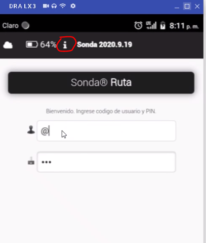
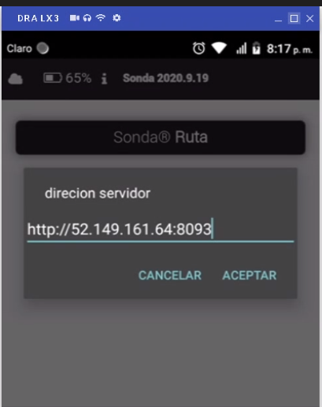

# Android
Pasos de instalación para la aplicación móvil (versiones 2020.7>)

## Instalación
1. Descargar aplicación
2. Abrir e instalar APK  
Va a aparecer un icono celeste con una "S" con el nombre "Sonde Route".  


## Agregar archivo de configuración
1. Conectar Handheld (HH) a una computadora
2. Dentro de la memoria de la HH agregar en el directorio `Android/data/com.mobilityscm.sonda.route` un archivo `conf.json`
3. El archivo `conf.json` tiene que tener la siguiente información:
```json
{
  "url": "http://{{Dirección del servicio de NodeJS}}"
}
```
Así tendría que quedar:
```
.
|- Android
|   |- data
|   |   |- com.mobilityscm.sonda.route
|   |   |   |- **conf.json**
```

## Configuración manual
Para configurar manualmente (en lugar del archivo) la dirección del servidor Node
1. En la pantalla login presionar la letra i de información indicada en la imagen

2. En la ventana de texto ingresar la URL
Importante recordar el `http://`.

3. Presionar Ok

