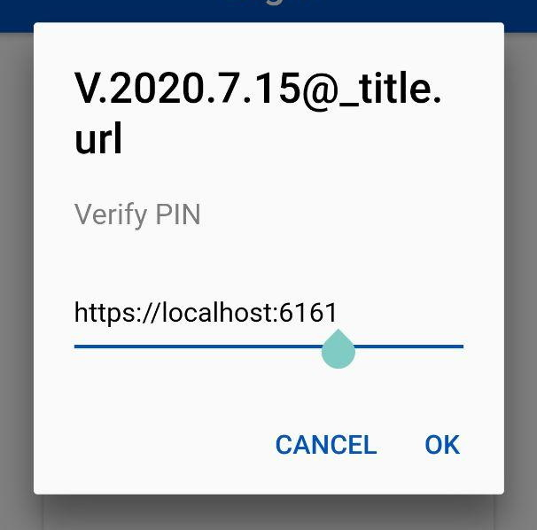

# Android
Pasos de instalación para la aplicación móvil (versiones 2020.7>)

## Instalación
1. Descargar aplicación
2. Abrir e instalar APK  
Va a aparecer un icono de una cabeza con un casco con el nombre "WMS".  


## Agregar archivo de configuración
1. Conectar Handheld (HH) a una computadora
2. Dentro de la memoria de la HH agregar en el directorio `Android/data/com.mobilityscm.swift3pl` un archivo `conf.json`
3. El archivo `conf.json` tiene que tener la siguiente información:
```json
{
  "url": "http://{{Dirección del servicio de NodeJS}}"
}
```
Así tendría que quedar:
```
.
|- Android
|   |- data
|   |   |- com.mobilityscm.swift3pl
|   |   |   |- **conf.json**
```

## Configuración manual
Para configurar manualmente (en lugar del archivo) la dirección del servidor Node
1. En la pantalla login presionar 20 veces el texto con el número de versión

2. En la ventana de texto ingresar la URL
Importante recordar el `http://`.

3. Presionar Ok

